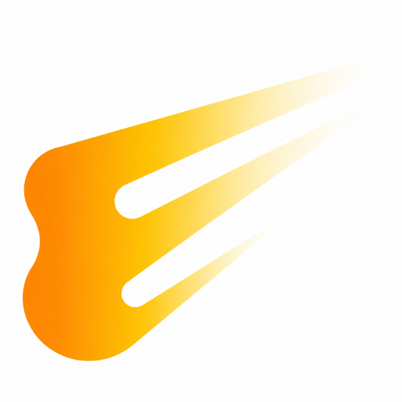
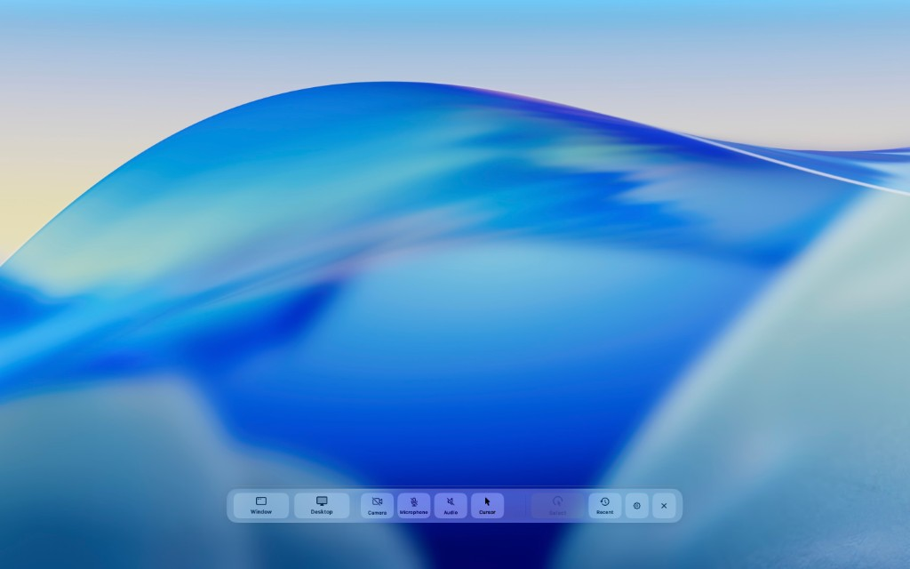
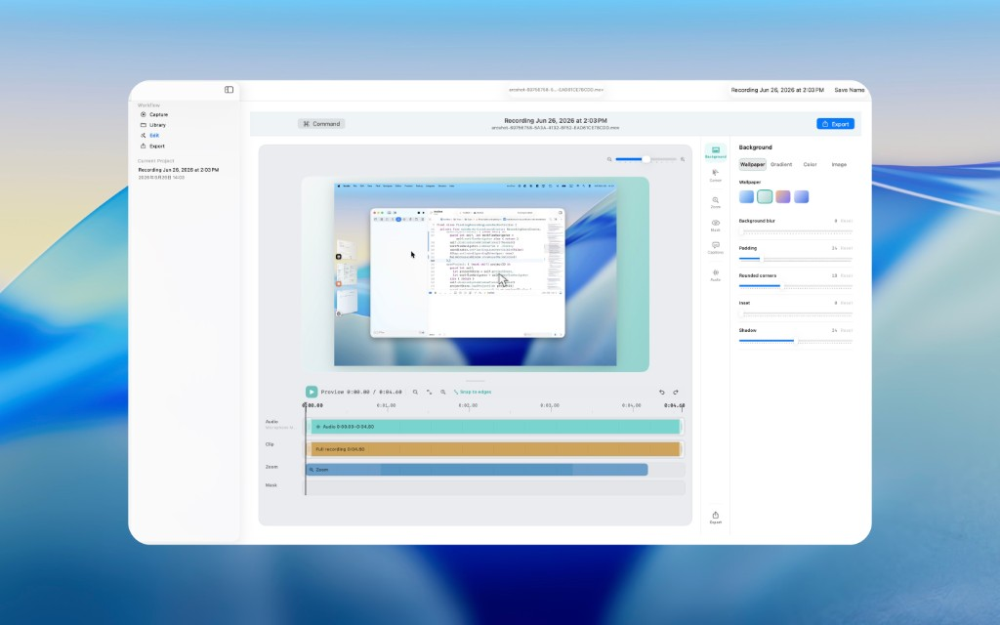
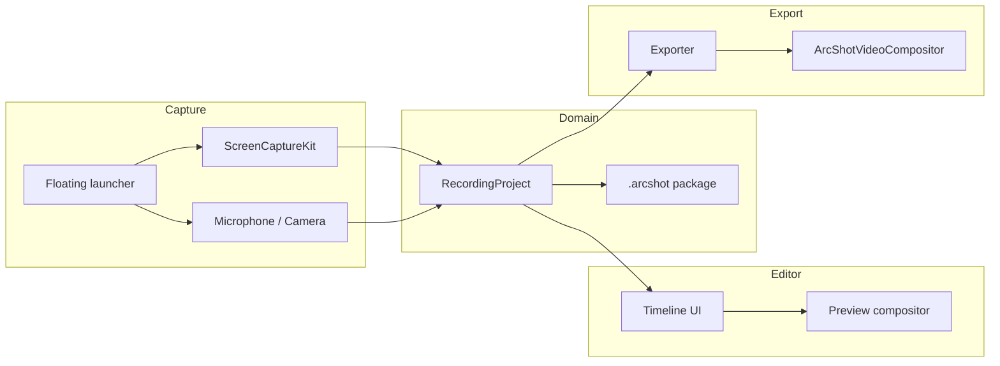

# ArcShot

<p align="center">
  
</p>

> **Swift-native macOS demo recorder** — floating launcher, multi-track timeline, custom `AVVideoCompositing` export.  
> **$7.99 one-time** · **full source on GitHub** · **260+ tests** · no subscription · no Electron

**A Swift-native macOS screen recorder and demo video editor — open source.**

Written in **Swift** and **SwiftUI**, wired to **ScreenCaptureKit** and **AVFoundation**. Record from a floating launcher, edit on a multi-track timeline, export a polished MP4 on your Mac. No account. No upload queue. No “please renew to export again.”

**Read the technical deep dive:** [How the export compositor pipeline works](docs/articles/compositor-pipeline.md)

[](https://github.com/mameshivaa/Arc-shot/actions/workflows/ci.yml)
[-blue.svg)](LICENSE)
[](Resources/Info.plist)
[](App/)
[](App/)
[](Features/Export/)

[Report an issue](https://github.com/mameshivaa/Arc-shot/issues) · [Architecture](docs/ARCHITECTURE.md) · [Distribution policy](docs/DISTRIBUTION.md) · [日本語](#日本語)

---

## Screenshots

| Floating launcher | Timeline editor |
| --- | --- |
|  |  |
| Quick capture bar for display/window, mic, system audio, camera, and cursor | Multi-lane timeline: audio waveform, clip trim, zoom segments, masks, inspector |

---

## Why this project exists

Premium macOS **demo-video recorders** are genuinely good at what they do: auto-zoom, cursor candy, backgrounds, and exports that look “designed” without opening Final Cut.

They are also genuinely good at **charging you forever**.

The category has largely settled on **subscriptions** — roughly **$9/month** if you commit annually, **$29/month** if you forget to — while affordable one-time licenses for new users have quietly left the chat. You get polished pixels and a recurring relationship with your credit card.

ArcShot exists because that deal annoyed me enough to write **~50k lines of Swift** instead.

| | Typical premium demo recorder | ArcShot |
| --- | --- | --- |
| **Billing** | Subscription (the gift that keeps billing) | **$7.99 one-time** + **source on GitHub** |
| **Stack** | Closed | **Swift / SwiftUI / ScreenCaptureKit / AVFoundation** |
| **Workflow** | Record → magic → export | Floating launcher → **multi-track timeline** → export |
| **Trust model** | “Trust our cloud” (often local, but still their binary) | **Local `.arcshot` projects**, sandboxed export, code you can read |

Fair warning: ArcShot does **not** try to out-sparkle the most polished motion presets on day one. It tries to be **yours** — buy once, build from source, keep your files, and still ship a demo that doesn’t look like QuickTime Player cosplaying as a product video.

This repository is the **public Swift codebase**. Fork it, audit it, fix my mistakes.

**Distribution:** third-party forks may **not** be republished on the Mac App Store ([LICENSE](LICENSE), [docs/DISTRIBUTION.md](docs/DISTRIBUTION.md)).

---

## Built with Swift (on purpose)

No Electron. No embedded Chromium “editor.” No “we’ll ship a web view and call it native.”

| Layer | Technology |
| --- | --- |
| **Language** | **Swift** — modern concurrency (`async`/`await`, `MainActor`), `@Observable` state |
| **UI** | **SwiftUI** — workspace shell, floating launcher, multi-lane timeline, inspectors |
| **Screen capture** | **ScreenCaptureKit** — display/window streams, system audio, cursor metadata (not burned into pixels) |
| **AV pipeline** | **AVFoundation** — `AVAssetWriter`, `AVPlayer` preview, reader/writer export sessions |
| **Compositor** | Custom **`ArcShotVideoCompositor`** (`AVVideoCompositing`) + instruction builder — preview/export geometry parity |
| **Speech** | **Speech** framework — on-device caption generation |
| **Camera / mic** | **AVCaptureSession** with documented session lifecycle invariants |
| **Persistence** | `Codable` **`RecordingProject`** model, `.arcshot` package on disk |
| **Tests** | **260+** unit & export smoke tests, CI on every push |

If you care about **real Mac engineering** — sandboxing, compositor math, cursor normalization, export parity — this repo is meant to be evidence, not marketing copy.

---

## Features

### Capture

- **Floating recording launcher** — primary UX; display or window via the macOS share picker
- **Countdown → record** — launcher REC must not block the UI thread (documented invariant)
- **Mic + system audio** — mixed into the recording session
- **Camera (PiP)** — optional sidecar `.mov`, unified geometry in preview and export
- **Cursor metadata** — sampled separately; drawn in compositor (cleaner zoom & effects)
- **Permissions** — Screen Recording required; mic / camera / speech optional per feature

### Editor

- **Multi-lane timeline** — clip, **audio waveform**, camera, **zoom**, **masks**, **captions**
- **Clip-style trim handles** — drag in/out on clip, audio, and camera segments
- **Speed changes** — per-clip pacing without leaving the app
- **Undo / redo** — timeline edits are reversible
- **Cursor & zoom** — click emphasis, shortcut overlays, cursor-focus zoom segments; auto-zoom analysis from click metadata
- **Stage styling** — wallpaper / gradient / solid / image backgrounds; padding, rounded corners, inset, shadow, background blur
- **Captions** — manual segments + **local speech recognition** (no upload step)
- **Inspector** — background, cursor, zoom, mask, caption, and audio tools in one workflow

### Export

- **Custom video compositor** — same geometry rules as preview (cursor, PiP, stage, captions, zoom)
- **MP4 output** — H.264 / HEVC
- **Aspect presets** — 16:9 · 9:16 · 1:1 · 4:3 · 3:4
- **Sandboxed write** — `ExportOutputAccess` + security-scoped URLs
- **Quality modes** — including match-source and Retina-aware bitrate behavior

### App & privacy

- **Local-first** — projects live in the app sandbox; no account server
- **English + Japanese** UI
- **Open source** — MIT with Mac App Store redistribution restricted for third parties

---

## Architecture at a glance



Deep dive: [`docs/ARCHITECTURE.md`](docs/ARCHITECTURE.md) · [`docs/articles/compositor-pipeline.md`](docs/articles/compositor-pipeline.md)

---

## Repository layout

| Path | Responsibility |
| --- | --- |
| `App/` | Shell, commands, localization, workspace windows |
| `Domain/` | `RecordingProject`, persistence, auto-zoom analysis |
| `Features/Capture/` | Screen/audio/camera capture, launcher, writer session |
| `Features/Editor/` | Timeline, inspector, playback controller |
| `Features/Export/` | AVFoundation pipeline, custom video compositor |
| `ArcShotTests/` | Unit tests + export smoke tests |

**Before changing capture / export / cursor code**, read [`docs/INVARIANTS.md`](docs/INVARIANTS.md).

---

## Requirements

- macOS **26.0+**
- Xcode **17+**
- Screen Recording permission (required)
- Microphone / Camera / Speech Recognition (optional, feature-dependent)

---

## Build & test

```sh
git clone https://github.com/mameshivaa/Arc-shot.git
cd Arc-shot
open ArcShot.xcodeproj
```

```sh
# Build
xcodebuild build -project ArcShot.xcodeproj -scheme ArcShot -destination 'platform=macOS'

# Test (260+ tests)
xcodebuild test -project ArcShot.xcodeproj -scheme ArcShot -destination 'platform=macOS'
```

Set your own **Development Team** in Xcode signing settings before archiving.

---

## Documentation

| Document | Description |
| --- | --- |
| [`docs/ARCHITECTURE.md`](docs/ARCHITECTURE.md) | System design for readers / recruiters |
| [`docs/articles/compositor-pipeline.md`](docs/articles/compositor-pipeline.md) | **Technical article** — capture → compositor → export |
| [`docs/INVARIANTS.md`](docs/INVARIANTS.md) | Hard rules with regression backing |
| [`docs/QUALITY_STANDARDS.md`](docs/QUALITY_STANDARDS.md) | Release quality bar |
| [`docs/MANUAL_VERIFICATION.md`](docs/MANUAL_VERIFICATION.md) | Manual QA matrix |
| [`docs/export/PIPELINE.md`](docs/export/PIPELINE.md) | Export pipeline map |
| [`docs/DISTRIBUTION.md`](docs/DISTRIBUTION.md) | What you may redistribute (no App Store) |
| [`SECURITY.md`](SECURITY.md) | Vulnerability reporting |
| [`CONTRIBUTING.md`](CONTRIBUTING.md) | Contribution guide |
| [`PRIVACY.md`](PRIVACY.md) | Privacy policy |

---

## Maintainer tools

Screenshot automation (`-screenshotTour`) and `Scripts/capture-app-screenshots.sh` are **maintainer-only** and live in the private development repository, not this public tree.

**Social preview** (GitHub のリンク用サムネイル): upload [`docs/assets/social-preview.png`](docs/assets/social-preview.png) (1280×640) in **GitHub → Settings → General → Social preview**.  
X や Slack でリポジトリ URL を貼ったときに出る横長画像です。README のスクショとは別枠。

**App icon:** [`docs/assets/app-icon.png`](docs/assets/app-icon.png) (512×512, copy of `Resources/Assets.xcassets/AppIcon.appiconset/`).

---

## Support & license

- **Issues:** https://github.com/mameshivaa/Arc-shot/issues
- **License:** [MIT — no Mac App Store redistribution](LICENSE)

---

## 日本語

**ArcShot** は **Swift / SwiftUI** で書いた、macOS 向けネイティブの画面録画・デモ動画エディタのオープンソース実装です。Electron でも WebView エディタでもありません。

<p align="center">
  
</p>

### なぜ作ったか

高価格帯の **デモ動画向けレコーダー** は、正直すごい。ズームもカーソルも背景も自動で整って、「編集ソフト開かなくていいじゃん」となる。

ただ、**料金設定もすごい**。サブスクが主流（年払いだと約 **$9/月**、月払いだと **$29/月**）で、新規ユーザー向けの安い買い切りはだいたい消えた。「映像は買い切りなのに、関係は月額」という世界に疲れたので、**Swift を書く方を選んだ**。

| | 一般的な高価格デモレコーダー | ArcShot |
| --- | --- | --- |
| **課金** | サブスク（自動更新のおともだち） | **買い切り $7.99** ＋ **ソース公開** |
| **実装** | クローズド | **Swift / SwiftUI / ScreenCaptureKit / AVFoundation** |
| **流れ** | 録画 → 自動仕上げ → 書き出し | ランチャー → **マルチトラックタイムライン** → 書き出し |

最もキラキラしたモーション自動化までは、最初から真似しない。代わりに **安い・買い切り・コードが読める・ローカル完結** を優先する。

### 技術スタック（Swift ネイティブ）

- **Swift + SwiftUI** — ランチャー、ワークスペース、タイムライン、インスペクタ
- **ScreenCaptureKit** — 画面／ウィンドウキャプチャ、システム音声、カーソルメタデータ
- **AVFoundation** — 録画 Writer、プレビュー Player、書き出しパイプライン
- **カスタム `ArcShotVideoCompositor`** — プレビューと書き出しの幾何を揃える
- **Speech** — 字幕のローカル音声認識
- **260+ テスト** — 不変条件付きの CI

### 機能

**録画:** フローティングランチャー、カウントダウン後に開始、マイク／システム音声／カメラ（PiP）、カーソルは後合成

**編集:** クリップ・音声波形・カメラ・ズーム・マスク・字幕のマルチレーン、トリム、速度変更、Undo/Redo、背景（壁紙／グラデーション／単色／画像）、パディング・角丸・影、カーソル強調とズームセグメント

**書き出し:** H.264 / HEVC MP4、16:9・9:16・1:1 など、サンドボックス経由の安全な出力

**その他:** 英日 UI、`.arcshot` ローカルプロジェクト、クラウドアカウント不要

**配布:** このリポジトリ由来のフォークを Mac App Store に載せることは [LICENSE](LICENSE) で禁止（著作権者本人を除く）。

採用・ポートフォリオ向け: [`docs/ARCHITECTURE.md`](docs/ARCHITECTURE.md) と [`docs/INVARIANTS.md`](docs/INVARIANTS.md) が設計の芯。

サポート: [Issues](https://github.com/mameshivaa/Arc-shot/issues)
