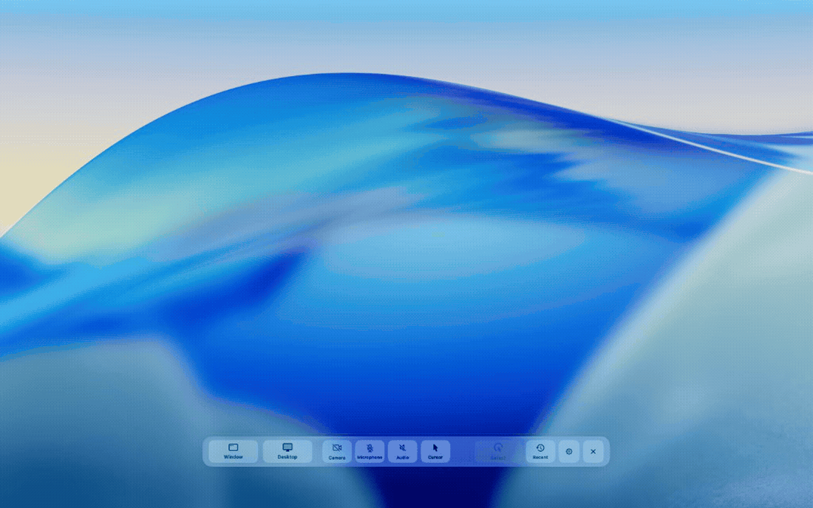
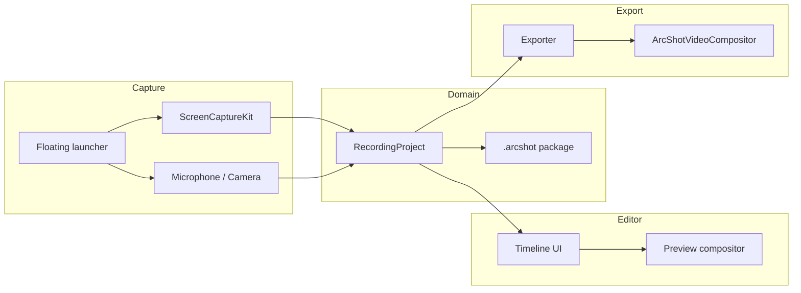

# ArcShot

**Native macOS screen recorder and demo video editor — [available on the Mac App Store](https://apps.apple.com/app/arcshot/id6778335789).**

Record from a floating launcher, edit on a multi-track timeline, and export a polished MP4 locally. No cloud account. No upload step. Preview and export are designed to match.

[](https://github.com/mameshivaa/Arc-shot/actions/workflows/ci.yml)
[](LICENSE)
[](Resources/Info.plist)
[](App/)

[Download on the Mac App Store](https://apps.apple.com/app/arcshot/id6778335789) · [Report an issue](https://github.com/mameshivaa/Arc-shot/issues) · [Architecture](docs/ARCHITECTURE.md) · [日本語](#日本語)

<p align="center">
  <a href="https://apps.apple.com/app/arcshot/id6778335789">
    
  </a>
</p>

<p align="center">
  
</p>

---

## Screenshots

| Floating launcher | Timeline editor |
| --- | --- |
|  |  |
| Quick capture bar for display/window, mic, system audio, camera, and cursor | Multi-lane timeline: audio waveform, clip trim, zoom segments, masks, inspector |

---

## Why this project exists

Most screen recorders stop at capture. ArcShot continues into **demo-video editing**: cursor-aware zoom, staged backgrounds, PiP camera, captions, and export presets — while keeping everything on the Mac.

This repository is the **open-source codebase** behind the App Store app. It is meant to be read, built, and extended.

---

## Highlights (portfolio / engineering)

| Area | What ArcShot does |
| --- | --- |
| **Capture** | ScreenCaptureKit streams, floating launcher UX, countdown → record invariant |
| **Cursor** | Metadata-driven cursor (not burned into capture); normalized mapping with `screenRect` parity |
| **Editor** | SwiftUI timeline with clip-style trim handles, audio/camera lanes, waveform display |
| **Export** | Custom `ArcShotVideoCompositor`, instruction builder, preview/export geometry parity |
| **Quality** | 260+ unit/smoke tests, documented invariants, CI on every push |
| **Privacy** | Local-first project packages (`.arcshot`), sandboxed export |

---

## Feature overview

- **Capture** — display or window recording from a floating bar; optional mic, system audio, and camera
- **Timeline** — trim clips, audio, and camera segments; speed changes; undo/redo
- **Cursor & zoom** — click effects, shortcut overlays, cursor-focus zoom segments
- **Polish** — backgrounds, padding, rounded stage, shadows, masks, captions (local speech recognition)
- **PiP camera** — unified geometry across preview, recording, and export
- **Export** — H.264 / HEVC MP4, 16:9 · 9:16 · 1:1 · 4:3 · 3:4
- **i18n** — English and Japanese UI

---

## Architecture at a glance



Deep dive: [`docs/ARCHITECTURE.md`](docs/ARCHITECTURE.md) · compositor notes: [`HANDOFF.md`](HANDOFF.md)

---

## Repository layout

| Path | Responsibility |
| --- | --- |
| `App/` | Shell, commands, localization, workspace windows |
| `Domain/` | `RecordingProject`, persistence, auto-zoom analysis |
| `Features/Capture/` | Screen/audio/camera capture, launcher, writer session |
| `Features/Editor/` | Timeline, inspector, playback controller |
| `Features/Export/` | AVFoundation pipeline, custom video compositor |
| `ArcShotTests/` | Unit tests + export smoke tests |

**Before changing capture / export / cursor code**, read [`docs/INVARIANTS.md`](docs/INVARIANTS.md).

---

## Requirements

- macOS **26.0+**
- Xcode **17+**
- Screen Recording permission (required)
- Microphone / Camera / Speech Recognition (optional, feature-dependent)

---

## Build & test

```sh
git clone https://github.com/mameshivaa/Arc-shot.git
cd Arc-shot
open ArcShot.xcodeproj
```

```sh
# Build
xcodebuild build -project ArcShot.xcodeproj -scheme ArcShot -destination 'platform=macOS'

# Test (260+ tests)
xcodebuild test -project ArcShot.xcodeproj -scheme ArcShot -destination 'platform=macOS'
```

Set your own **Development Team** in Xcode signing settings before archiving.

---

## Documentation

| Document | Description |
| --- | --- |
| [`docs/ARCHITECTURE.md`](docs/ARCHITECTURE.md) | System design for readers / recruiters |
| [`docs/INVARIANTS.md`](docs/INVARIANTS.md) | Hard rules with regression backing |
| [`docs/QUALITY_STANDARDS.md`](docs/QUALITY_STANDARDS.md) | Release quality bar |
| [`docs/MANUAL_VERIFICATION.md`](docs/MANUAL_VERIFICATION.md) | Manual QA matrix |
| [`docs/export/PIPELINE.md`](docs/export/PIPELINE.md) | Export pipeline map |
| [`SECURITY.md`](SECURITY.md) | Vulnerability reporting |
| [`CONTRIBUTING.md`](CONTRIBUTING.md) | Contribution guide |
| [`PRIVACY.md`](PRIVACY.md) | Privacy policy |

---

## Maintainer tools

Regenerate App Store-style screenshots (requires local sample projects + screen recording permission):

```sh
./Scripts/capture-app-screenshots.sh
```

---

## Support & license

- **Issues:** https://github.com/mameshivaa/Arc-shot/issues
- **License:** [MIT](LICENSE)

---

## 日本語

**ArcShot** は、[Mac App Store](https://apps.apple.com/jp/app/arcshot/id6778335789) で配信中のネイティブ画面録画・デモ動画エディタのオープンソース版です。

<p align="center">
  <a href="https://apps.apple.com/jp/app/arcshot/id6778335789">
    
  </a>
</p>

- フローティングランチャーから画面／ウィンドウを録画
- タイムラインでクリップ・音声・インカメをトリム
- カーソルズーム、背景、PiP、字幕、MP4 書き出し
- クラウド不要・ローカル完結

採用・ポートフォリオ向けに読む場合は [`docs/ARCHITECTURE.md`](docs/ARCHITECTURE.md) と [`docs/INVARIANTS.md`](docs/INVARIANTS.md) から入ると、設計のこだわりが伝わりやすいです。

サポート: [Issues](https://github.com/mameshivaa/Arc-shot/issues)
