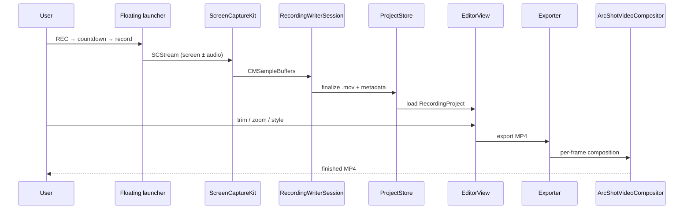

# ArcShot Architecture

ArcShot is a **Swift-native** macOS app for **screen capture → timeline editing → MP4 export**. This document is written for contributors, reviewers, and portfolio readers who want the system shape without reading every file.

**Stack:** Swift · SwiftUI · ScreenCaptureKit · AVFoundation · custom `AVVideoCompositing` · Speech (captions). No Electron, no embedded web editor.

**Source:** build from this repository. Third-party Mac App Store distribution is not permitted — see [`DISTRIBUTION.md`](DISTRIBUTION.md).

---

## Design goals

0. **Accessible demo-video tooling** — subscription-based demo recorders on macOS charge a lot for polish; ArcShot is Swift, one-time purchase, and open source instead.
1. **Local-first** — projects live in sandboxed `.arcshot` packages on disk; no account or upload step.
2. **Preview/export parity** — what you see in the editor should match exported pixels (cursor, zoom, PiP, stage, captions).
3. **Explicit invariants** — capture, launcher, and export hot paths have documented rules and tests ([`INVARIANTS.md`](INVARIANTS.md)).
4. **Native stack** — SwiftUI + ScreenCaptureKit + AVFoundation; no Electron, no embedded browser compositor.

---

## End-to-end flow



---

## Module map

| Layer | Key types | Role |
| --- | --- | --- |
| **App** | `ArcShotRuntime`, `ContentView`, `WorkflowNavigator` | Window shell, sidebar workflow (capture / library / edit / export) |
| **Capture** | `RecordingCoordinator`, `RecordingWriterSession`, `FloatingRecordingWidget` | Permissions, SCStream lifecycle, floating launcher UX |
| **Domain** | `RecordingProject`, `ProjectStore`, `ProjectStorageCatalog` | JSON project model, `.arcshot` packages, library scan |
| **Editor** | `EditorView`, `EditorTimelineView`, `EditorPlaybackController` | Multi-lane timeline, inspector, AVPlayer preview |
| **Export** | `Exporter`, `ArcShotVideoCompositor`, `ArcShotCompositionInstructionBuilder` | Reader/writer session, custom compositor, presets |
| **Tests** | `ArcShotTests`, `ExportSmokeTests` | Geometry parity, export pixel probes, capture invariants |

---

## Capture pipeline

- **ScreenCaptureKit** delivers BGRA frames; `showsCursor = false` so the cursor is drawn from sampled metadata later.
- **Cursor normalization** uses `screenRect ?? contentRect` when mapping global mouse position — documented in [`INVARIANTS.md`](INVARIANTS.md) §1.
- **Microphone / camera** share careful `AVCaptureSession` ordering (`commitConfiguration` before `startRunning`).
- **Floating launcher** is the primary UX path: REC → countdown → yield → `startRecording` (must not block SwiftUI).

Primary files:

- `Features/Capture/RecordingCoordinator.swift`
- `Features/Capture/RecordingWriterSession.swift`
- `Features/Capture/FloatingRecordingWidget.swift`

---

## Editor & timeline

- **Lanes:** clip, audio (with waveform), camera, zoom, masks — clip-style trim handles with live drag surfaces.
- **Playback** uses `AVPlayer` plus overlay layers that approximate export styling (cursor, captions, stage).
- **Undo** for timeline edits via `ReviewTimelineUndoController`.

Primary files:

- `Features/Editor/EditorTimelineView.swift`
- `Features/Editor/EditorView.swift`
- `Features/Editor/EditorPlaybackController.swift`

---

## Export pipeline

1. `Exporter` builds composition + instructions from `RecordingProject`.
2. `ArcShotCompositionInstructionBuilder` encodes per-frame zoom, PiP, stage, captions, masks.
3. `ArcShotVideoCompositor` renders in Core Image / Core Animation space with CI bottom-left conventions handled consistently.
4. `ExportOutputAccess` + sandbox promotion write the final MP4.

See also: [`export/PIPELINE.md`](export/PIPELINE.md), [`articles/compositor-pipeline.md`](articles/compositor-pipeline.md).

---

## Project storage

```
MyProject.arcshot/
  project.json      # RecordingProject
  media/            # main .mov, camera sidecar, assets
  exports/          # optional exported files
```

`ProjectStorageCatalog` scans the library; `ProjectLibraryView` is the in-app browser.

---

## Testing strategy

| Class | Examples |
| --- | --- |
| **Unit** | Cursor mapping with `screenRect` offset, zoom parity, timeline math |
| **Export smoke** | Solid-color fixtures, PiP pixel probes, staged background samples |
| **Localization** | `AppLanguageStore`, string keys |

Run: `xcodebuild test -project ArcShot.xcodeproj -scheme ArcShot -destination 'platform=macOS'`

---

## What to read first (portfolio path)

1. This file — system map  
2. [`INVARIANTS.md`](INVARIANTS.md) — engineering rigor  
3. `Features/Export/ArcShotVideoCompositor.swift` — hardest rendering code  
4. `Features/Capture/RecordingCoordinator.swift` — capture orchestration  
5. `Features/Editor/EditorTimelineView.swift` — timeline UX complexity  

---

## Related products (positioning)

ArcShot targets **polished demo videos** (product walkthroughs, tutorials, bug reports) — not a screenshot manager or cloud screen-recorder clone.
