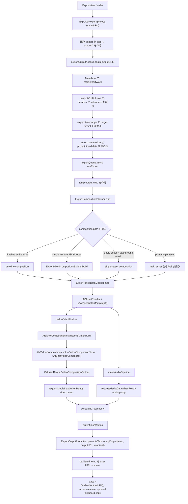
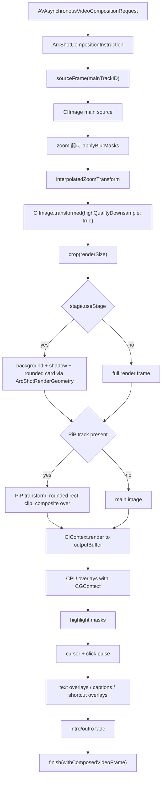

# 書き出しパイプライン現状整理

日付: 2026-06-22

この文書は M7 のリファクタで、ArcShot の現在の MP4 書き出し処理を固定するための現状整理です。
GIF export は削除済みで、ここでは現存機能として扱わない。

## 先に守るルール

この領域を触る前に `docs/INVARIANTS.md` を読むこと。

- カーソル座標は、プロジェクト内では「正規化された下原点座標」として保存される。Y を二重反転しない。
- 録画元動画にはシステムカーソルを焼き込まない。書き出し時にカーソルメタデータから描画する。
- MP4 書き出しは、まず app/container の temp ファイルへ出力し、検証後にユーザーが選んだ URL へ昇格する。その間 `ExportOutputAccess` が security-scoped access を保持する。
- source-resolution preset はアップスケールしない。bitrate は出力ピクセル数に応じてスケールする。
- compositor で縮小する箇所は `highQualityDownsample: true` を維持する。
- 書き出しの描画の正本は `ArcShotVideoCompositor` と `ArcShotCompositionInstructionBuilder`。

## 主要ファイルと責務

| ファイル | 現在の責務 |
| --- | --- |
| `Features/Export/Exporter.swift` | public export API、UI 状態、保存先 access、MP4 target format 決定、temp promotion、clipboard copy。 |
| `Features/Export/ExportCompositionPlanner.swift` | MP4 export の reader asset path 選択、timeline/single/PiP/background-music composition、main/PiP track、duration/timeRange/timedDataOffset の計画。 |
| `Features/Export/ExportTimedDataMapper.swift` | zoom、motion、cursor、highlight、text/caption/shortcut、click、mask、camera layout を composition seconds に変換し、sanitize する。 |
| `Features/Export/ExportPIPTimelineSourceMapper.swift` | timeline clip と speed segment から PiP sidecar の source slice を決める。 |
| `Features/Export/ExportOutputPromotion.swift` | temp URL 生成、temp artifact cleanup、MP4 validation、検証済み temp の user URL への昇格。 |
| `Features/Export/ExportVideoPipelineFactory.swift` | video composition output、video writer input、audio reader/writer IO、cursor densify、PiP transform、audio mix を作る。 |
| `Features/Export/ExportReaderWriterSession.swift` | AVAssetReader/Writer の作成、media pump、progress callback、finishWriting、reader/writer failure result。 |
| `Features/Export/ExportOutputAccess.swift` | 書き出し中、ユーザーが選んだ出力ファイルと親ディレクトリへの security-scoped access を保持する。 |
| `Features/Export/ExportMixedCompositionBuilder.swift` | 単一 source asset と sidecar camera movie から、main + PiP の単純な 2-track composition を作る。 |
| `Features/Export/ArcShotCompositionInstructionBuilder.swift` | zoom と camera layout の境界で video composition timeline を分割し、segment ごとの描画メタデータを詰める。 |
| `Features/Export/ArcShotCompositionInstruction.swift` | `AVVideoCompositionInstructionProtocol` の payload。track ID、transform、zoom、cursor、stage、fade、text overlay、mask、PiP clip、motion plan を持つ。 |
| `Features/Export/ArcShotVideoCompositor.swift` | 1 frame ごとの renderer。source video、blur mask、zoom、stage、PiP、cursor/click、highlight mask、text/caption、fade を描画する。 |
| `Features/Editor/EditorPlaybackController.swift` | preview 用の AV composition と background music/audio mix を作る。visual preview には export compositor を使っていない。 |
| `Features/Editor/EditorLayout.swift` | preview/export 共通の geometry helper。特に `ArcShotRenderGeometry`。 |

`Exporter.swift` は orchestration と sandbox/output state を持つ。次に分割する場合も、M7-01/M7-02 の現状把握と parity audit を前提にする。

## MP4 正常系



## composition path の選択

`ExportCompositionPlanner.plan` は reader に渡す asset を 4 通りから選ぶ。

| 条件 | reader asset | main/PiP track | 時間の扱い |
| --- | --- | --- | --- |
| `project.timeline.activeClips` がある | planner が作る新しい `AVMutableComposition` | main timeline track + optional PiP track | timed data は `timeline.timeMappings()` で timeline seconds に写す。 |
| active clips なし、PiP sidecar あり | `ExportMixedCompositionBuilder.build` が作る新しい `AVMutableComposition` | trim window に揃えた main video + PiP video | timed data は export start 分だけ shift する。 |
| active clips なし、background music あり | planner が作る single-asset `AVMutableComposition` | main video/audio + looped background music | timed data は export start 分だけ shift する。 |
| plain single asset | 元の `AVURLAsset` | main video + 元 audio | reader に `timeRange` が設定される場合がある。`timedDataOffsetSeconds = exportStart`。 |

重要点: `timedDataOffsetSeconds` が非ゼロになるのは、plain single asset path で reader が非ゼロの source time range を読む場合だけ。composition path は timeline が 0 秒始まりになる。

## 時間付きデータの変換

video pipeline を作る前に、`ExportTimedDataMapper` は描画用メタデータを composition 秒へ変換する。

| データ | timeline path | non-timeline composition path |
| --- | --- | --- |
| Zoom keyframes | `mapZoomKeyframesForTimeline` 後に sanitize | `RecordingProject.shiftZoomKeyframesForCompositionExport` |
| Auto-zoom motion frames | `mapMotionFramesForTimeline` | `shiftMotionFramesForCompositionExport` |
| Cursor samples | `mapCursorSamplesForTimeline` | `shiftCursorSamplesForCompositionExport` |
| Cursor highlight regions | `mapHighlightRegionsForTimeline` | `RecordingProject.shiftHighlightRegionsForCompositionExport` |
| Text/captions/keyboard shortcuts | `mapTextOverlaysForTimeline` 後に sanitize | `RecordingProject.shiftTextOverlaysForCompositionExport` 後に sanitize |
| Click cues | `mapClickCuesForTimeline` 後に clamp/sort | `RecordingProject.shiftClickCuesForCompositionExport` 後に clamp/sort |
| Visual masks | `mapVisualMasksForTimeline` 後に sanitize | `shiftVisualMasksForCompositionExport` 後に sanitize |
| Camera layout segments | `mapCameraLayoutSegmentsForTimeline` 後に sanitize | `shiftCameraLayoutSegmentsForCompositionExport` 後に sanitize |

ここは密度が高く、feature ごとに境界条件が違う。テストで全部守れる根拠なしに、汎用 helper へ雑にまとめない。

## video pipeline

`ExportVideoPipelineFactory.makeVideoPipeline` が AVFoundation の video 側を組み立てる。

1. main video track の natural size と preferred transform を読む。
2. `ExportVideoGeometry.aspectFitBaseTransform` で `mainBaseTransform` を作る。
3. PiP track があれば PiP の geometry を読む。
4. PiP attachment があれば aspect-fill transform を作る。
5. cursor samples を最大 1/60 秒間隔に densify する。これは export-only で project file は変えない。
6. `ArcShotCompositionInstructionBuilder.Input` を作る。
7. `AVVideoComposition.Configuration` を作る。
   - `renderSize = target.size`
   - `frameDuration = 1 / target.frameRate`
   - `instructions = ArcShotCompositionInstructionBuilder.build(input:)`
   - `customVideoCompositorClass = ArcShotVideoCompositor.self`
8. `AVAssetReaderVideoCompositionOutput` を作る。
9. H.264 または HEVC の `AVAssetWriterInput` を、scaled bitrate と frame-rate 設定付きで作る。

## instruction builder

`ArcShotCompositionInstructionBuilder` は timeline を次の境界で分割する。

- export start/end
- zoom start, in-end, out-start, end
- camera layout segment start/end

各 segment に詰めるもの:

- main/PiP track ID
- main base transform と source size
- PiP transform と clip rect
- active zoom state と、segment 境界 0.12 秒 ramp 用の previous zoom state
- その segment に関係する cursor samples、click cues、cursor highlight regions
- active text overlays
- active visual masks
- filtered motion plan frames
- stage config と fade config

builder は pixel を描かない。compositor が使う segment ごとの instruction payload を作るだけ。

## compositor の 1 frame flow

`ArcShotVideoCompositor.processRequest` は現在これを描画する。



現在の compositor は、zoom、stage background/card/shadow/rounded clip、PiP placement/mirroring/rounded clip/aspect-fill、blur masks、highlight masks、cursor/click pulse、captions/text/keyboard shortcut overlays、fade を描画している。

## audio pipeline

`ExportVideoPipelineFactory.makeAudioPipeline` は次を行う。

- reader asset から audio tracks を読む。
- 48 kHz stereo linear PCM の `AVAssetReaderAudioMixOutput` を作る。
- microphone/system/background settings が明示されている場合だけ `audioMix(for:settings:)` を適用する。
- 192 kbps AAC の writer input を作る。

preview 側には、関連するが別実装の `EditorPlaybackController.previewAudioMix` がある。

## validation と output promotion

video/audio pump 完了後:

1. `AVAssetWriter.finishWriting`
2. reader/writer の failure state を確認
3. `ExportOutputPromotion` が temp output を検証
   - video track がある
   - encoded size が manifest render size と合う
   - duration が許容範囲内
   - nominal frame rate が許容範囲内
   - codec subtype が H.264/HEVC と合う
   - frame count が 1 frame 以内の誤差
4. `promoteTemporaryOutput` で既存 output を消して、temp file を user URL へ move
5. MainActor state を `.finished(outputURL)` にする
6. `ExportOutputAccess.release()`
7. 必要なら clipboard copy

## cancel / failure path

`Exporter.stop()` は次を行う。

- progress timer を invalidate
- reader と writer を cancel
- active temporary output artifacts を削除
- reader/writer/export ID/temp URL を clear
- progress と clipboard flag を reset
- `.exporting` state を `.idle` へ戻す
- `ExportOutputAccess` を release

async completion 側でも、`runExport` は結果を受け入れる前に `activeExportID` を確認する。キャンセル済み、または別 export に置き換わっていた場合は temp artifacts を削除し、ユーザー出力へ昇格しない。

既存 coverage: `testExporterCancellationPreservesExistingOutputAndRemovesPartialOutput`

## 削除済み: GIF export

GIF 書き出しは MP4 pipeline と別物で、custom compositor、validation、cancellation protection、temp promotion を通らなかった。
この基盤整理で GIF export UI/API/path/localized strings は削除し、export は MP4 のみにした。
今後 GIF など別形式を戻す場合は、軽量な side path ではなく、MP4 と同じ validation、cancel、temp-output promotion の基準を満たす新しい設計として扱う。

## preview/export parity の現状

短く言うと:

- export は多くの feature で rendered-pixel smoke coverage を持っている。
- preview は基本的に SwiftUI と shared geometry helper で再現しており、export compositor をそのまま使ってはいない。
- 残リスクは「export に描画がない」よりも、「preview と export の完全な raster parity が未検証」という性質が強い。

残リスク:

| Feature | 現在のリスク |
| --- | --- |
| Zoom | mid-ramp と preview/export の full raster parity。 |
| Cursor / click | preview は SwiftUI 描画、export は CoreGraphics `CursorRenderer`。 |
| Stage | preview は SwiftUI/material gradient/shadow、export は CoreImage/raster compositing。 |
| Masks | blur preview は近似であり、export の Gaussian blur と完全一致しない。 |
| Text/captions/keyboard shortcuts | preview は SwiftUI text layout、export は CoreText。line break/glyph rasterization がずれる可能性。 |
| Fade | timing semantics は同じだが、rendering stack が違う。 |
| Camera PiP | 短い exact-frame export coverage はあるが、長尺 sync と preview/export raster parity は残る。 |

## 現在の分割状態

M7-03 の主要分割として、composition planning、timed data mapping、output promotion、video/audio pipeline factory、reader/writer session は分離済み。

| 候補 | 持たせる責務 | 注意点 |
| --- | --- | --- |
| `ExportCompositionPlanner` | reader asset path の選択、timeline/single/PiP/background-music composition、main/PiP track result、duration/timeRange/timedDataOffset。 | 追加済み。AVFoundation composition の選択だけに集中させる。 |
| `ExportTimedDataMapper` | project timed data を composition seconds に変換する。 | 追加済み。feature-specific な mapping/sanitize 順序を保つ。 |
| `ExportPIPTimelineSourceMapper` | timeline clips から PiP sidecar の source slice を作る。 | 追加済み。speed segment と clip source window の意味を変えない。 |
| `ExportOutputPromotion` | temp URL、temp artifact cleanup、validation、user URL への promotion。 | 追加済み。validation 成功前に user output を削除しない。 |
| `ExportVideoPipelineFactory` | `makeVideoPipeline`、`makeAudioPipeline`、instruction builder input、reader/writer media IO。 | 追加済み。compositor と encoding/audio settings は変更しない。 |
| `ExportReaderWriterSession` | reader/writer 作成、media pump、progress callback、finishWriting、reader/writer failure result。 | 追加済み。promotion、UI state、access release は `Exporter` に残す。 |

compositor rewrite から始めない。現行 compositor は主要な instruction-carried visual features をすでに描画しており、export smoke coverage もある。

## この領域を守るテスト

基本コマンド:

```sh
xcodebuild test -project ArcShot.xcodeproj -scheme ArcShot -destination 'platform=macOS'
```

重要ファイル:

- `ArcShotTests/ExportSmokeTests.swift`: MP4 export smoke、validation、cancellation、trim/timeline/speed、stage、cursor/click、text/caption、fade、camera PiP、masks、background music、preview audio mix。
- `ArcShotTests/ArcShotTests.swift`: geometry、preview/export timing and coordinate parity、stage policy/shadow、PiP clip、timeline source mapping。

2026-06-23 時点の確認済み baseline: 252 tests passing。
